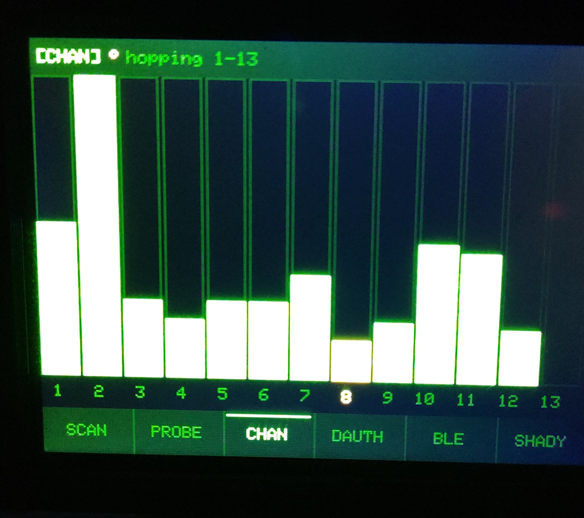
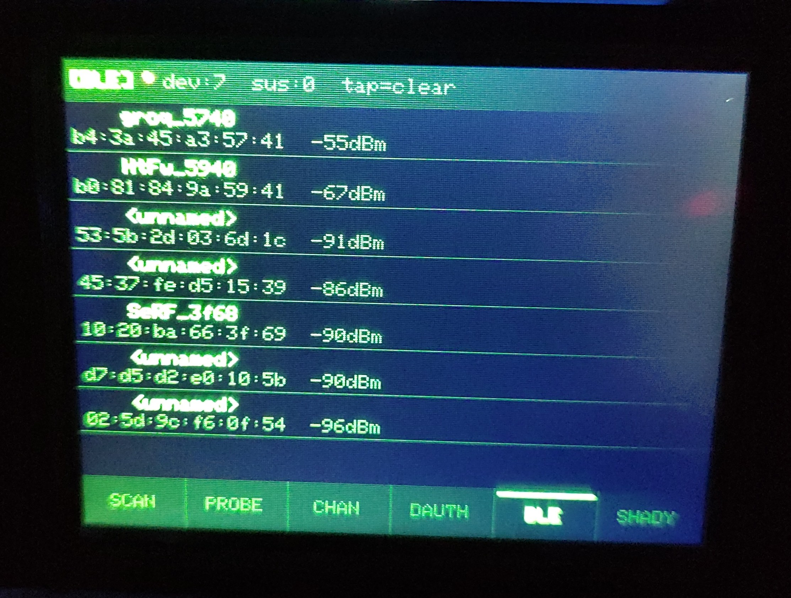

# CYD Advanced WiFi & BLE Scanner

A feature-rich wireless security scanner and sniffer for the **ESP32-2432S028R (CYD — Cheap Yellow Display)**. Born from the fusion of two prior projects, rebuilt and expanded into a clean hacker-terminal UI with six independent scanning modes.

> **Hardware:** ESP32-2432S028R · ILI9341 320×240 touchscreen · XPT2046 touch · RGB LED · SD card (optional)

---

## Screenshots

| SCAN Mode | CHAN Mode | BLE Mode |
|-----------|-----------|----------|
|  |  |  |

*15 networks sorted by signal strength with live bars, dBm, channel, and encryption type · Channel activity heatmap hopping 1–13 · BLE device hunter showing MAC + RSSI*

---

## Modes

All six modes are accessible from the touch footer bar at the bottom of the screen. Tap any label to switch instantly.

### `[SCAN]` — WiFi Network Scanner
Async WiFi scan with compact AntiPMatrix-style display. Results persist on screen during rescans — no more blank flicker.

- Up to 40 networks displayed, sorted by signal strength (strongest first)
- Continuous color-coded signal bar per network: **green** (strong) · **yellow** (medium) · **red** (weak)
- Shows: SSID · lock icon · signal bar · dBm · channel · encryption type (WPA2/WPA3/WPA+/OPEN)
- Hidden networks deduplicated by BSSID and sorted to the bottom, labeled `[Hidden]`
- Header shows live count: `15 nets (0 hidden)` with `↻` spinner during active scan
- Rescans every 5 seconds automatically
- Touch upper/lower body to scroll

### `[PROBE]` — Probe Request Sniffer
Promiscuous mode capture of 802.11 probe request frames.

- Shows the last 8 probe requests with source MAC and requested SSID
- Wildcard probes (devices broadcasting for any network) labeled `<wildcard>`
- Updates in real time as frames are captured
- Touch to scroll history

### `[CHAN]` — Channel Activity Monitor
Live bar chart of 802.11 frame activity across all 13 WiFi channels.

- Auto-hops channel every 200ms, counting all frames seen on each channel
- Tap a channel bar to **lock** onto that channel; tap again to resume hopping
- Locked channel number highlighted in the header
- Great for visualizing channel congestion at a glance

### `[DAUTH]` — Deauth Attack Detector
Monitors for 802.11 deauthentication and disassociation frames — the hallmark of WiFi deauth attacks.

- Tracks per-BSSID deauth rate (frames/sec over a sliding 3-second window)
- **ALERT** flag triggers when rate exceeds threshold (≥5/sec)
- RGB LED flashes **red** when an attack is detected
- Shows BSSID, total frame count, and computed rate
- Tap body to clear the alert log

### `[BLE]` — Bluetooth Low Energy Scanner
Non-blocking BLE device discovery running on a dedicated FreeRTOS task.

- Detects nearby BLE devices with MAC address, name, and RSSI
- **Skimmer hunter**: flags devices matching known ATM/POS skimmer MAC prefixes
- **Threat detection**: unknown/unnamed devices at strong signal flagged as suspicious
- RGB LED pulses **blue** when scanning
- Shows: device name (or `<unnamed>`) · BSSID · RSSI · threat flag

### `[SHADY]` — Suspicious Network Analyzer
Scans for WiFi networks with behavioral red flags — rogue APs, PineAP pineapples, and evil twins.

- Suspicion scoring system: **OPEN** network · **HIDDEN** SSID · **STRONG** signal (possible nearby AP) · **BEACON SPAM** (special characters in SSID)
- **PineAP detection**: tracks BSSIDs broadcasting multiple different SSIDs (≥3 = flagged)
- Results sorted by suspicion score descending
- RGB LED flashes **yellow** when shady networks are found

---

## UI Layout

```
┌──────────────────────────────────────┐
│  [MODE]  •  status / count / info    │  ← Header (20px)
├──────────────────────────────────────┤
│                                      │
│           mode content               │  ← Body (200px)
│                                      │
├──────────────────────────────────────┤
│  SCAN │ PROBE │ CHAN │DAUTH│ BLE │SHADY│  ← Footer touch bar (20px)
└──────────────────────────────────────┘
```

- **Green-on-black** hacker terminal theme throughout
- Active mode tab highlighted with white text
- `•` live indicator in header pulses during active scanning
- RGB LED (active LOW): red=deauth alert · blue=BLE · yellow=shady · green=touch feedback

---

## Hardware Pinout

| Function | GPIO |
|----------|------|
| Display DC | 2 |
| Display CS | 15 |
| Display SCK | 14 |
| Display MOSI | 13 |
| Display MISO | 12 |
| Backlight | 21 |
| Touch CLK | 25 |
| Touch MISO | 39 |
| Touch MOSI | 32 |
| Touch CS | 33 |
| Touch IRQ | 36 |
| RGB LED R | 4 (active LOW) |
| RGB LED G | 16 (active LOW) |
| RGB LED B | 17 (active LOW) |
| SD SCK | 18 |
| SD MISO | 19 |
| SD MOSI | 23 |
| SD CS | 5 |

---

## SD Card Logging

If an SD card is present (FAT32 formatted), all scan events are appended to `/cydscan.txt` with mode-prefixed entries:

```
[SCAN] SSID:"PsyClock                  " CH:01 RSSI:-30  WPA2 b4:fb:e4:xx:xx:xx
[PROBE] MAC:AA:BB:CC:DD:EE:FF SSID:"MyHomeNetwork"
[DEAUTH] BSSID:AA:BB:CC:DD:EE:FF rate:8.3/s total:25
[BLE] NAME:HC-08 MAC:aa:bb:cc:dd:ee:ff RSSI:-55 SKIMMER
[SHADY] SSID:"FreeWiFi" score:3 flags:OPEN,STRONG,HIDDEN
```

SD card is optional — the scanner runs fully without one.

---

## Build & Flash

**Requirements:** PlatformIO (VS Code extension or CLI)

```bash
# Clone and enter project
cd CYDWiFiScanner

# Build
pio run

# Flash (CYD connected via USB)
pio run --target upload

# Monitor serial output (115200 baud)
pio device monitor
```

**platformio.ini highlights:**
- `board_build.partitions = huge_app.csv` — required for BLE (3MB app partition)
- `board_build.f_cpu = 240000000L` — full 240MHz for responsive UI
- BLE enabled via `-DCONFIG_BT_ENABLED=1 -DCONFIG_BLUEDROID_ENABLED=1`

## Known Issues & Notes

### ⚠️ First Boot: Switch Away from SCAN Before Using It
On first flash or cold boot, **tap any other mode first** (e.g. PROBE, CHAN) and then return to SCAN. Going straight into SCAN immediately after boot can cause a crash/reboot. This is a known quirk of the WiFi stack initialization timing — harmless, and a fix may come in a future update.

---

## Inverted Display Version (`InvertedCYDWifiScanner/`)

An identical copy of this project exists in `InvertedCYDWifiScanner/` for CYD boards that ship with the ILI9341 display wired with inverted color polarity. The **only difference** is one line added to setup:

```cpp
gfx->invertDisplay(true);
```

This corrects the hardware-level color inversion at the display controller. **Expect the colors to look different from the original** — the green-on-black theme will shift to different hues depending on the specific panel. This is normal for inverted conversions; the UI layout and all functionality remain identical.

---

## External IPEX Antenna Mod (CYD)

This CYD board ships with the RF path set to the onboard PCB antenna.  
To use the IPEX (u.FL) connector, **move the 0Ω RF selector resistor** from the PCB-antenna pad to the IPEX pad, which switches the antenna path to the external connector.

> ⚠️ Only one antenna path should be connected at a time — do not bridge both pads.

An external antenna improves WiFi and BLE scan range significantly, which directly benefits all modes in this scanner.

---


This project is a fusion of two prior builds:

| Version | Description |
|---------|-------------|
| **Jan 2026** (`OriginalPredDetectorJan2026/`) | Original ESP32-2432S028 WiFi/BLE Predator Detection — BLE skimmer hunter, shady WiFi analyzer, PineAP detection |
| **Mar 2026** (current `src/`) | Full rewrite merging both projects: 6-mode scanner, AntiPMatrix-style SCAN display, fixed async scan engine, SD logging, RGB LED, touch UI |

The `OriginalPredDetectorJan2026/` folder is preserved in this repo as the pre-merge reference.

---

## Legal Notice

This tool is intended for **educational and authorized security research purposes only**. Only use on networks and devices you own or have explicit permission to test. Passive scanning (SCAN, PROBE, CHAN, BLE) is generally legal; active interference is not. The authors assume no responsibility for misuse.
