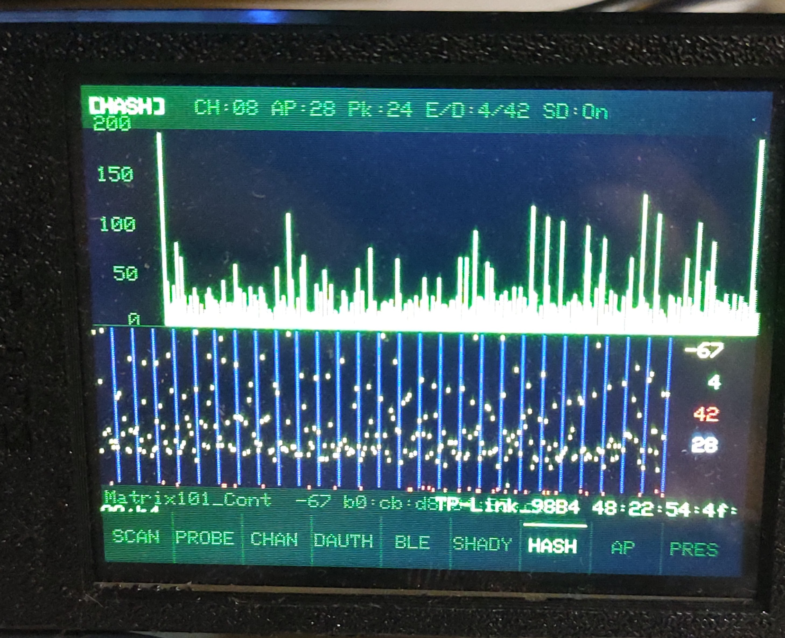
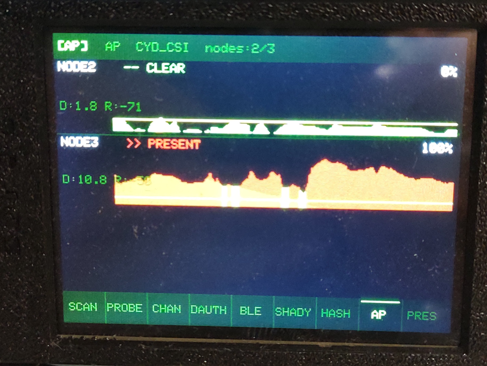

# CYDSentinel

A feature-rich wireless security scanner, sniffer, human presence detector, and **NEXRAD radar workspace** for the **ESP32-2432S028R (CYD — Cheap Yellow Display)**. Nine independent scanner modes stay on the touch footer bar, and the new radar view lives in the header so the same device can flip between wireless recon and local weather.

> **Hardware:** ESP32-2432S028R · ILI9341 320×240 touchscreen · XPT2046 touch · RGB LED · SD card (optional)

---

## Screenshots

| SCAN Mode | CHAN Mode | BLE Mode | RADAR Mode |
|-----------|-----------|----------|------------|
|  |  |  |  |

*15 networks sorted by signal strength with live bars, dBm, channel, and encryption type · Channel activity heatmap hopping 1–13 · BLE device hunter showing MAC + RSSI · Local NEXRAD radar view centered on the saved home location*

| HASH Mode | AP Dashboard |
|-----------|--------------|
|  |  |

*HASH: dual-graph WPA handshake sniffer — packet rate bars (top) + RSSI/EAPOL/deauth dot graph (bottom), 28 APs and 4 EAPOL frames captured · AP dashboard: 2 of 3 nodes connected — NODE2 clear, NODE3 at 100% PRESENT with full red sparkline*

---

## Two Firmware Builds + Headless Node

This repo contains **three firmware builds**:

| Folder | Board | Display |
|--------|-------|---------|
| `src/` | Standard CYD (ESP32-2432S028R) | Normal color polarity |
| `InvertedCYDWifiScanner/` | Inverted CYD variant | `invertDisplay(true)` applied |
| `C3PRES/` | ESP32-C3 (any variant, no screen) | Headless — LED only |

Flash the correct CYD build for your board. If colors look wrong (white appears black, green appears magenta), use the inverted build.

The **C3PRES** firmware runs on a bare ESP32-C3 with no screen — it boots directly into presence detection mode and reports telemetry to the AP. LED on GPIO 8 indicates state (fast blink = connecting, triple flash = calibrating, heartbeat = clear, solid = present).

---

## Modes

All nine modes are accessible from the touch footer bar at the bottom of the screen. Tap any label to switch instantly.

### `[SCAN]` — WiFi Network Scanner
Async WiFi scan with compact terminal-style display. Results persist on screen during rescans — no blank flicker.

- Up to 40 networks displayed, sorted by signal strength (strongest first)
- Color-coded signal bar per network: **green** (strong) · **yellow** (medium) · **red** (weak)
- Shows: SSID · lock icon · signal bar · dBm · channel · encryption type (WPA2/WPA3/WPA+/OPEN)
- Hidden networks deduplicated by BSSID and sorted to the bottom, labeled `[Hidden]`
- Header shows live count: `15 nets (0 hidden)` with `↻` spinner during active scan
- Rescans every 5 seconds automatically
- Touch upper/lower body to scroll

### `[PROBE]` — Probe Request Sniffer
Promiscuous mode capture of 802.11 probe request frames.

- Shows the last 8 probe requests with source MAC and requested SSID
- Wildcard probes (devices broadcasting for any network) labeled `<wildcard>`
- Updates in real time as frames are captured
- Touch to scroll history

### `[CHAN]` — Channel Activity Monitor
Live bar chart of 802.11 frame activity across all 13 WiFi channels.

- Auto-hops channel every 200ms, counting all frames seen on each channel
- Tap a channel bar to **lock** onto that channel; tap again to resume hopping
- Locked channel number highlighted in the header
- Great for visualizing channel congestion at a glance

### `[DAUTH]` — Deauth Attack Detector
Monitors for 802.11 deauthentication and disassociation frames — the hallmark of WiFi deauth attacks.

- Tracks per-BSSID deauth rate (frames/sec over a sliding 3-second window)
- **ALERT** flag triggers when rate exceeds threshold (≥5/sec)
- RGB LED flashes **red** when an attack is detected
- Shows BSSID, total frame count, and computed rate
- Tap body to clear the alert log

### `[BLE]` — Bluetooth Low Energy Scanner
Non-blocking BLE device discovery running on a dedicated FreeRTOS task.

- Detects nearby BLE devices with MAC address, name, and RSSI
- **Skimmer hunter**: flags devices matching known ATM/POS skimmer MAC prefixes and names
- **Threat detection**: unknown/unnamed devices at strong signal flagged as suspicious
- RGB LED pulses **blue** when scanning
- Shows: device name (or `<unnamed>`) · MAC · RSSI · threat flag

### `[SHADY]` — Suspicious Network Analyzer
Scans for WiFi networks with behavioral red flags — rogue APs, PineAP pineapples, and evil twins.

- Suspicion scoring: **OPEN** network · **HIDDEN** SSID · **STRONG** signal · **BEACON SPAM** (special chars in SSID)
- **PineAP detection**: tracks BSSIDs broadcasting multiple different SSIDs (≥3 = flagged)
- Results sorted by suspicion score descending
- RGB LED flashes **yellow** when shady networks are found

### `[HASH]` — WPA Handshake & EAPOL Sniffer
Promiscuous capture of WPA2 handshake (EAPOL) frames with PCAP file output.

- Tracks beacons (AP MAC → SSID mapping) and EAPOL frames in real time
- Dual live graphs: packets/sec bar chart + RSSI/EAPOL/deauth dot graph
- Saves captured frames to SD card as standard libpcap files (`/hash{timestamp}.pcap`) — open in Wireshark
- Channel hops across all 13 channels every 500ms
- Footer shows last beacon SSID/MAC and last EAPOL SSID/MAC

### `[AP]` — RF Beam Access Point *(Hub device)*
Turns this CYD into the center of the presence detection network. Acts as both the WiFi AP that PRES nodes connect to and a live **multi-node dashboard** showing all connected sensors.

- Creates AP: **SSID:** `CYD_CSI` · **Password:** `cydscanner123`
- Runs a TCP server (port 80) streaming `ping\n` every 20ms — constant bidirectional traffic is what makes RSSI-based detection reliable
- Receives UDP telemetry from each connected PRES node
- **Live dashboard**: up to 3 PRES nodes displayed simultaneously, each with:
  - Status label (`>> PRESENT` / `?? MAYBE` / `-- CLEAR`) color-coded red/yellow/green
  - Live confidence percentage
  - Full-width sparkline graph of signal deviation history
  - Current DIFF (dBm deviation) and raw RSSI values
- Stale nodes (no packet for 5+ seconds) dim automatically
- Place this device centrally; surround with PRES/C3PRES nodes

### `[PRES]` — Human Presence Detector *(Sensor device)*
Connects to an `[AP]`-mode CYD and uses **WiFi RSSI beam-break detection** to sense human presence. Your body absorbs and reflects 2.4GHz WiFi — when you cross the signal path between devices, the received signal strength drops measurably.

- Exponential moving average (EMA, α=0.15) smooths raw RSSI readings
- Deviation from calibrated empty-room baseline drives detection
- Three detection states: **`-- CLEAR`** · **`?? MAYBE`** · **`>> PRESENT`**
- Confidence bar (0–100%) with color coding
- Full-width sparkline with red/yellow threshold lines always visible
- Peak deviation tracker (`PK:`) to help tune thresholds
- **Auto-calibrates 10 seconds after connecting** — no manual step needed
  - Screen shows `auto-cal in Xs` countdown while waiting
  - Tap to calibrate immediately instead of waiting
  - Tap again at any time to reset a bad calibration
- Sends live telemetry to the AP dashboard every 100ms
- RGB LED: **red** = present · **yellow** = maybe · **off** = clear
- Logs presence events to SD card

---

## Presence Detection — How It Actually Works

### The physics

2.4GHz WiFi is absorbed and reflected by the human body. When a person stands or moves in the signal path between two devices, the received signal strength (RSSI) drops by a measurable amount — typically 4–15 dBm depending on distance and body angle. This is the same principle as a microwave motion sensor, except we're using WiFi hardware you already have.

```
[AP / CYD #1] ──────── RF path ──────── [PRES / CYD #2 or C3]
                           👤
                      person here
                   (absorbs 2.4GHz)
                  RSSI drops ↓ → detected
```

### Why this works better than CSI variance

We started with WiFi Channel State Information (CSI) subcarrier variance — a technique used in research papers for through-wall presence detection. In practice on these ESP32 boards, CSI callbacks only fire on received ACK frames, which meant the AP needed to actively receive unicast packets for detection to work at all. Even after fixing that, the variance values were inconsistent and hard to threshold reliably.

**RSSI beam-break is simpler, more reliable, and immediate:**
- The PRES device reads `WiFi.RSSI()` every 100ms and feeds it into an exponential moving average
- At calibration time the clean baseline is stored
- Every subsequent reading is compared: `deviation = |movingAvg - baseline|`
- Deviation above threshold = detection

No CSI callbacks, no frame counting, no timing tricks — just signal strength math.

### The traffic requirement

Raw `WiFi.RSSI()` on a connected STA reflects the last received beacon or ACK. If there's no active traffic, the value barely changes even when someone walks through the path. The AP's TCP server solves this: it streams `ping\n` every 20ms to any connected client, and the PRES nodes send UDP telemetry every 100ms back to the AP. This bidirectional traffic means fresh ACKs are constantly flowing, so every `RSSI()` call reflects the current signal state.

### Network topology

```
         [C3PRES]
            |
[PRES CYD] ─┼─ WiFi ─── [AP CYD dashboard]
            |
         [PRES CYD]
```

All nodes connect to the AP's softAP. The AP shows a live 3-panel dashboard with one graph per node. Each PRES node (CYD or C3) independently measures its own signal path to the AP.

### Setup

1. **One CYD as AP**: tap `[AP]` — it creates the network and waits
2. **Remaining CYDs as PRES**: tap `[PRES]` — each connects automatically
3. **C3PRES nodes**: flash and power on — they connect and calibrate without any interaction
4. Each PRES device **auto-calibrates 10 seconds after connecting** — just make sure the signal path is clear during that window
5. Walk through the beam — detection is immediate

### Placement

- Devices **facing each other across the space** you want to monitor — 3–15 feet apart
- Line of sight is best; works through interior walls with reduced sensitivity
- Place the AP centrally and surround it with PRES nodes for multi-zone coverage
- Avoid placement near metal, fish tanks, or anything that moves independently
- Same height as the area of interest (chest-height for a hallway, floor-level for under a door)

### Calibration

- Auto-calibrates 10s after connecting — screen shows `auto-cal in Xs` countdown
- Tap during countdown to calibrate immediately
- Tap at any time after calibration to reset (re-calibrates from scratch on next connect)
- Green LED flash = calibration complete

### Tuning

```cpp
#define RSSI_DIFF_LO     3.0f   // dBm deviation → MAYBE (>0% confidence)
#define RSSI_DIFF_HI     8.0f   // dBm deviation → PRESENT (100% confidence)
#define RSSI_AVG_ALPHA   0.15f  // EMA smoothing (lower = smoother but slower)
```

Watch `PK:` (peak deviation) on the PRES screen while walking through the beam. Set `RSSI_DIFF_HI` to roughly your observed peak. `RSSI_AVG_ALPHA` — lower values (0.05–0.10) are more stable but slower to react; higher (0.20–0.30) react faster but noisier.

---

## UI Layout

```
┌──────────────────────────────────────────────┐
│  [MODE]  •  status / count / info            │  ← Header (20px)
├──────────────────────────────────────────────┤
│                                              │
│              mode content                    │  ← Body
│                                              │
├──────────────────────────────────────────────┤
│ SCAN│PROBE│CHAN│DAUTH│BLE│SHADY│HASH│AP│PRES │  ← Footer touch bar
└──────────────────────────────────────────────┘
```

- **Green-on-black** hacker terminal theme throughout
- Active mode tab highlighted with white text
- RGB LED (active LOW): red=deauth/present · blue=BLE · yellow=shady/maybe · green=calibration done

---

## Hardware Pinout

| Function | GPIO |
|----------|------|
| Display DC | 2 |
| Display CS | 15 |
| Display SCK | 14 |
| Display MOSI | 13 |
| Display MISO | 12 |
| Backlight | 21 |
| Touch CLK | 25 |
| Touch MISO | 39 |
| Touch MOSI | 32 |
| Touch CS | 33 |
| Touch IRQ | 36 |
| RGB LED R | 4 (active LOW) |
| RGB LED G | 16 (active LOW) |
| RGB LED B | 17 (active LOW) |
| SD SCK | 18 |
| SD MISO | 19 |
| SD MOSI | 23 |
| SD CS | 5 |

---

## SD Card Logging

If an SD card is present (FAT32 formatted), all scan events are appended to `/cydscan.txt`:

```
[SCAN] SSID:"PsyClock" CH:01 RSSI:-30  WPA2 b4:fb:e4:xx:xx:xx
[PROBE] MAC:AA:BB:CC:DD:EE:FF SSID:"MyHomeNetwork"
[DEAUTH] BSSID:AA:BB:CC:DD:EE:FF rate:8.3/s total:25
[BLE] NAME:HC-08 MAC:aa:bb:cc:dd:ee:ff RSSI:-55 SKIMMER
[SHADY] SSID:"FreeWiFi" score:3 flags:OPEN,STRONG,HIDDEN
[HASH EAPOL] SSID:"HomeNet" BSSID:XX:XX:XX:XX:XX:XX EAPOL#15
[PRES] var:4.50 conf:50 rssi:-53
```

HASH mode also saves PCAP files (`/hash{timestamp}.pcap`) openable in Wireshark.

SD card is optional — the scanner runs fully without one.

---

## Build & Flash

**Requirements:** PlatformIO (VS Code extension or CLI)

```bash
# Build and flash standard CYD firmware
cd CYDWiFiScanner
pio run --target upload

# Build and flash inverted display firmware
cd InvertedCYDWifiScanner
pio run --target upload

# Build and flash C3PRES headless node
cd CYDWiFiScanner/C3PRES
pio run --target upload

# Monitor serial output (115200 baud)
pio device monitor
```

**platformio.ini highlights:**
- `board_build.partitions = huge_app.csv` — required for BLE (3MB app partition)
- `board_build.f_cpu = 240000000L` — full 240MHz for responsive UI
- BLE enabled via `-DCONFIG_BT_ENABLED=1 -DCONFIG_BLUEDROID_ENABLED=1`
- C3PRES uses default partitions (no BLE needed)

---

## Known Issues & Notes

### ⚠️ First Boot: Switch Away from SCAN Before Using It
On first flash or cold boot, **tap any other mode first** (e.g. PROBE, CHAN) and then return to SCAN. Going straight into SCAN immediately after boot can cause a crash/reboot. This is a known quirk of the WiFi stack initialization timing — harmless.

### ⚠️ PRES Mode: Keep the Signal Path Clear for 10 Seconds After Connecting
Auto-calibration fires 10 seconds after the PRES device connects. If someone is standing in the beam during that window, the baseline will be set with a person in it — making subsequent detection unreliable. Either clear the area during boot, or tap to reset and re-calibrate once the area is empty.

### ⚠️ PRES Mode: RSSI Below -70
If RSSI on the PRES device is consistently below -70 dBm, move the devices closer together. Weak signal reduces the measurable delta when a person walks through — target -40 to -60 dBm for best results.

### ℹ️ Detection is beam-break, not whole-room
The PRES/C3PRES devices detect disturbances specifically in the signal path between themselves and the AP. Someone in another part of the room who isn't crossing that path may not register. Use multiple nodes at different angles for broader coverage.

---

## External IPEX Antenna Mod (CYD)

This CYD board ships with the RF path set to the onboard PCB antenna.
To use the IPEX (u.FL) connector, **move the 0Ω RF selector resistor** from the PCB-antenna pad to the IPEX pad.

> ⚠️ Only one antenna path should be connected at a time — do not bridge both pads.

An external antenna improves WiFi and BLE scan range significantly, which directly benefits all modes including presence detection.

---

## Project History

| Version | Description |
|---------|-------------|
| **Jan 2026** (`OriginalPredDetectorJan2026/`) | Original ESP32-2432S028 predator detection — BLE skimmer hunter, shady WiFi analyzer, PineAP detection |
| **Mar 2026 v1** | Full rewrite: 9-mode scanner, WPA handshake capture, PCAP logging, initial WiFi CSI presence detection (AP + PRES modes), calibration countdown, inverted display variant |
| **Mar 2026 v2** (current `src/`) | Detection rebuilt from scratch: replaced CSI variance with **RSSI EMA beam-break detection** — immediate, reliable, works on all ESP32 variants. Added AP multi-node dashboard (up to 3 live PRES nodes with sparklines). Added headless ESP32-C3 PRES node firmware (`C3PRES/`). Auto-calibration on connect. |

The `OriginalPredDetectorJan2026/` folder is preserved as the pre-merge reference.

---

## Legal Notice

This tool is intended for **educational and authorized security research purposes only**. Only use on networks and devices you own or have explicit permission to test. Passive scanning (SCAN, PROBE, CHAN, BLE) is generally legal; active interference is not. The authors assume no responsibility for misuse.
